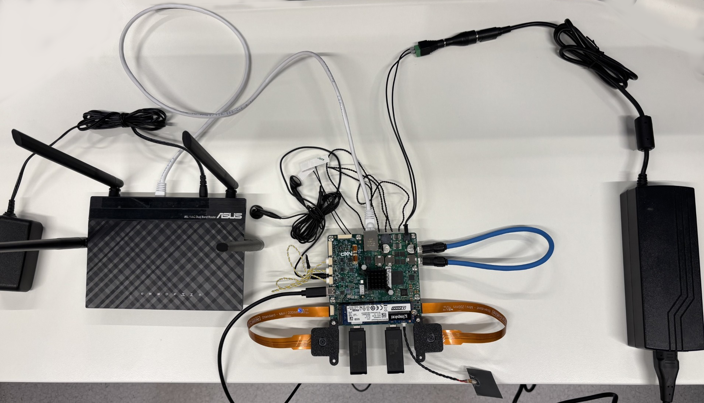
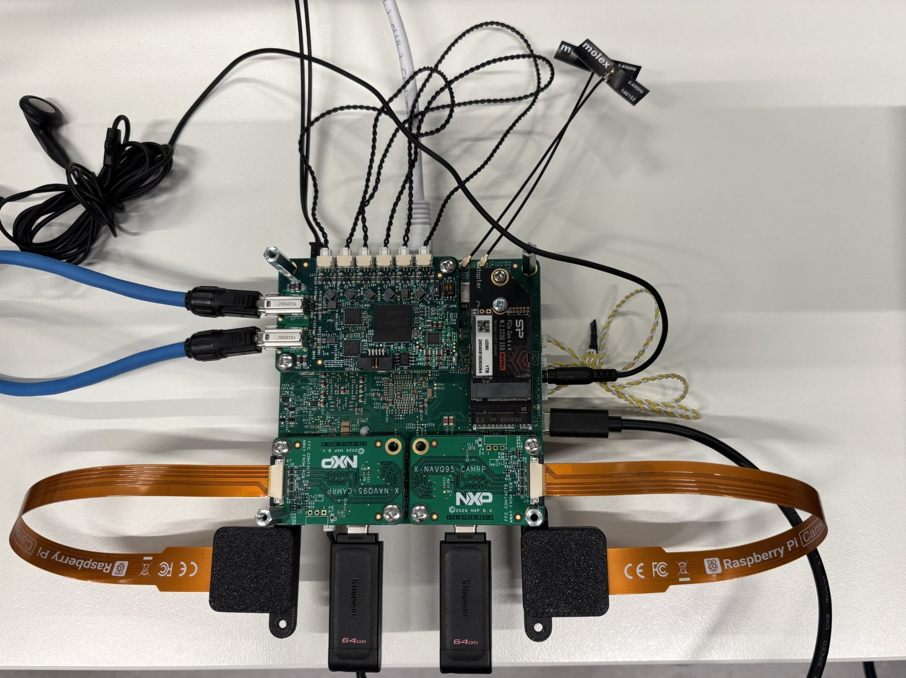

# NavQ95 EMC Test Software

## Description

This repository contains the EMC test software for the NavQ95 platform. The software exercises the onboard hardware components at high utilization levels, generating representative worst-case operating conditions to support Electromagnetic Compatibility (EMC) testing and validation.

## Installation

Obtain the SD card image for the NavQ95 from [imx-manifest-navq95](https://github.com/NXP-Robotics/imx-manifest-navq95) by either building the Yocto image yourself or by downloading one of the [releases](https://github.com/NXP-Robotics/imx-manifest-navq95/releases).

Write the image to an SD card, and boot up the NavQ95. Instruction on how to write the image onto an SD card can be found [here](https://github.com/NXP-Robotics/imx-manifest-navq95#flash-image-to-sd-card).

The console can be accessed in two ways:

- **J10 USB-C connector** on the IO board (provides a TTY interface over USB)
- **J2 connector** on the main board (UART)

Log in as 'user' (password: 'user').

Run the following commands on the A55 console to install the EMC test services:

```bash
git clone git@github.com:NXP-Robotics/navq95-emc-test.git
cd navq95-emc-test
sudo ./install.sh
```

## Prerequisites

The following external devices are required to run the test software:

- USB drives inserted in J13 and J12
- NVMe SSD in the M.2 Key M slot
- External network infrastructure:
  - An Ethernet switch connected to the Ethernet port on J8
  - A Wi-Fi access point with an SSID that the NavQ95 Wi-Fi interface is configured to join
- A CAN bus loopback wire connecting all NavQ95 CAN interfaces (J4, J8, and J9 on the IO shield) to each other, without termination resistors

> **NOTE:** USB drives, NVMe SSDs, and eMMC storage devices must be formatted with a filesystem supported by the NavQ95. The recommended filesystem is ext4.

> **NOTE:** The Wi-Fi interface must be configured to connect to a wireless network before starting the tests. Run `sudo nmtui` to attach to an SSID.

## Features

### Test Services

A number of test services are available. All services are enabled and run simultaneously by default, but each service can be individually enabled or disabled as needed.

For a full overview of the available services, see the `services/` directory.

### Monitor

The test services are monitored to verify that they are active. The result is indicated by the RGB LED on the NavQ95:

| LED color | Meaning |
|-----------|---------|
| <span style="color:red">**RED**</span> | One or more tests are not active |
| <span style="color:green">**GREEN**</span> | All tests are active |
| Any other color, or LED off | The monitor service is not running |

### Additional Device Utilization

In addition to running the test services, several optional actions can be performed to further increase device utilization. These do not require the test services to be running.

- **Apply SJA1110 loopback**

  This increases utilization of the SJA1110 network switch by connecting a loopback cable, which causes transmitted traffic to be fed back into the switch. Broadcast messages are particularly impactful because they continuously circulate through the network, multiplying the traffic and significantly increasing switch utilization.

  The loopback cable can be inserted in two 100BASE-T1 ports or two 1000BASE-T1 ports.

  The PHY configuration of the SJA1110 firmware must be updated accordingly: one port must be configured as MASTER and the other as SLAVE.

- **Run Cognipilot/Cerebri on the M7 core**

  Running Cognipilot/Cerebri on the M7 core enables IMU sensor data acquisition, introducing additional processing load and increasing overall device utilization.
  A Cererbri image can be found [here](https://github.com/NXP-Robotics/imx-manifest-navq95/releases) and use [this deployment instruction](https://github.com/NXP-Robotics/imx-manifest-navq95#flash-nor-flash-image) to install it on the NavQ95.

## Usage

Basic usage:

1. Power on the NavQ95.
2. Wait for the LED to blink green, which indicates that all test services are active.
3. Perform the EMC test.

By default, all EMC services are active after boot and the board continuously runs its high-utilization loops. If individual parts of the board need to be tested separately, the EMC test software can be controlled via the Linux console (TTY).

### Helper Scripts

The repository provides convenience scripts to manage all test services at once:

| Script | Description |
|--------|-------------|
| `start.sh` | Starts all test services simultaneously |
| `stop.sh` | Stops all test services simultaneously |
| `status.sh` | Displays the current status of all test services |

```bash
# Start all services
sudo ./start.sh

# Stop all services
sudo ./stop.sh

# Show the status of all services
sudo ./status.sh
```

### Managing Individual Services

Individual test services can be started and stopped using `systemctl`:

```bash
# Stop a service
sudo systemctl stop emc-test-can.service

# Start a service
sudo systemctl start emc-test-can.service
```

### Available Test Services

| Service | Description |
|---------|-------------|
| `emc-test-audio.service` | Exercises the audio interface |
| `emc-test-bluetooth.service` | Exercises the Bluetooth interface |
| `emc-test-cameras.service` | Exercises both camera interfaces |
| `emc-test-can.service` | Exercises the CAN bus interfaces |
| `emc-test-console.service` | Exercises the serial console |
| `emc-test-emmc.service` | Exercises the eMMC storage |
| `emc-test-ethernet.service` | Exercises the Ethernet interface |
| `emc-test-nvme1.service` | Exercises the first NVMe SSD |
| `emc-test-nvme2.service` | Exercises the second NVMe SSD |
| `emc-test-sdcard.service` | Exercises the SD card |
| `emc-test-usb1.service` | Exercises the first USB storage device |
| `emc-test-usb2.service` | Exercises the second USB storage device |
| `emc-test-wifi.service` | Exercises the Wi-Fi interface |

The monitor service is `emc-test-monitor.service`.

## Uninstallation

All services can be disabled and removed from the boot sequence using the uninstall helper script:

```bash
# Uninstall (disable) all services
sudo ./uninstall.sh
```

## Others

[Parts and connections](connections.md)

[Generated clock frequencies](navq95-generated-frequencies.md)



