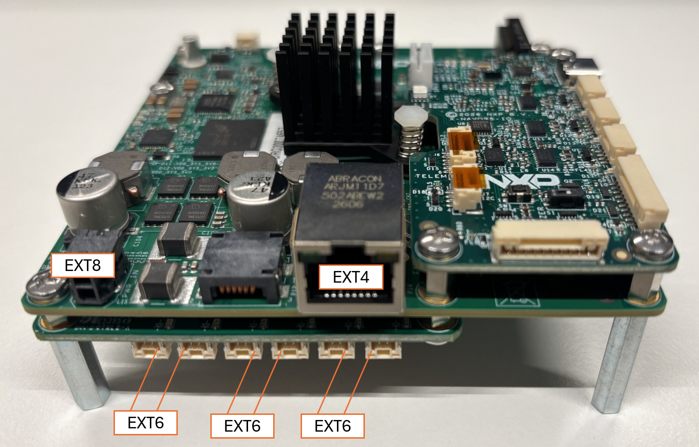
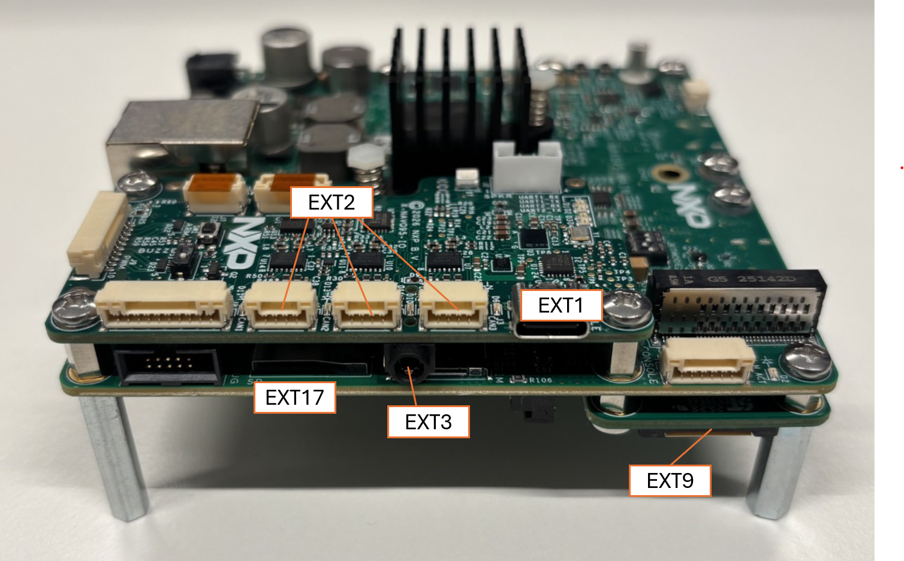
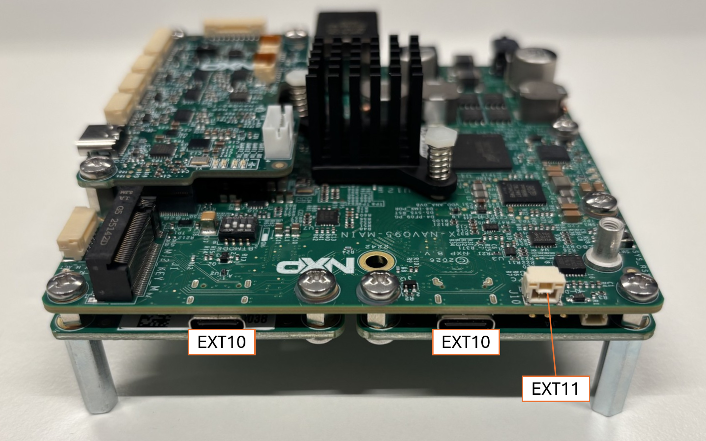
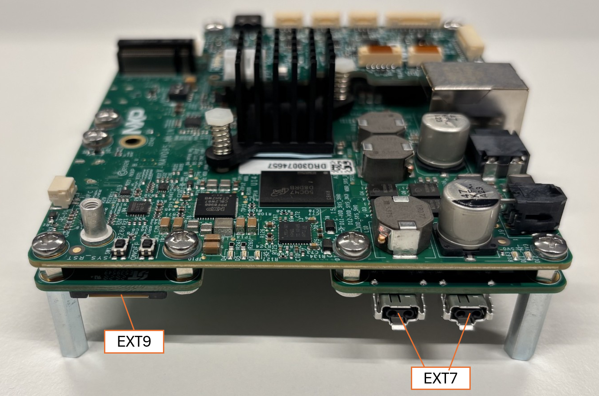
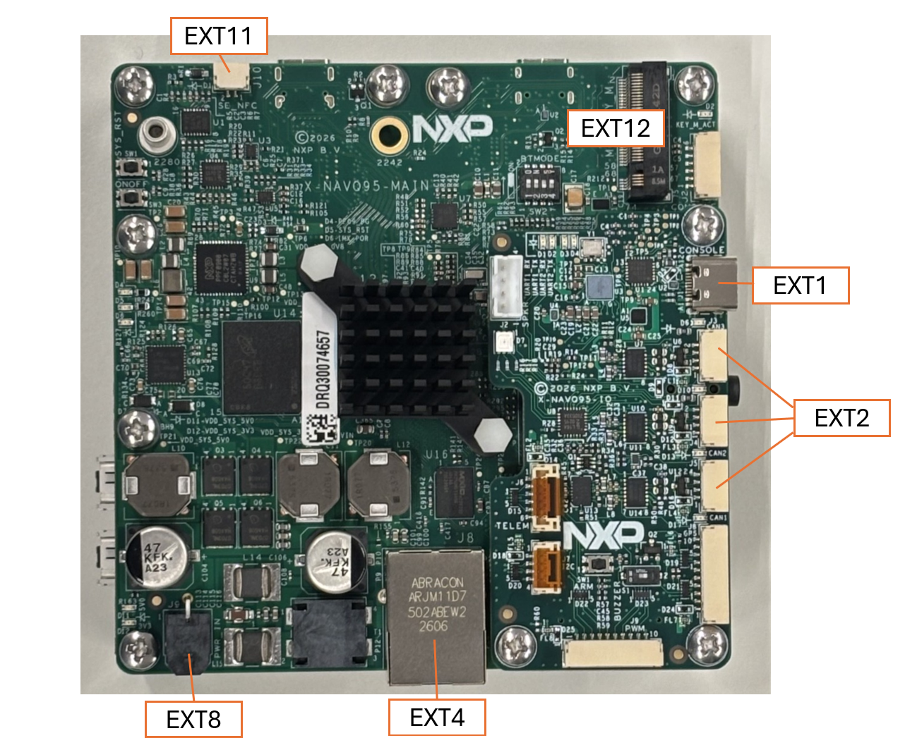
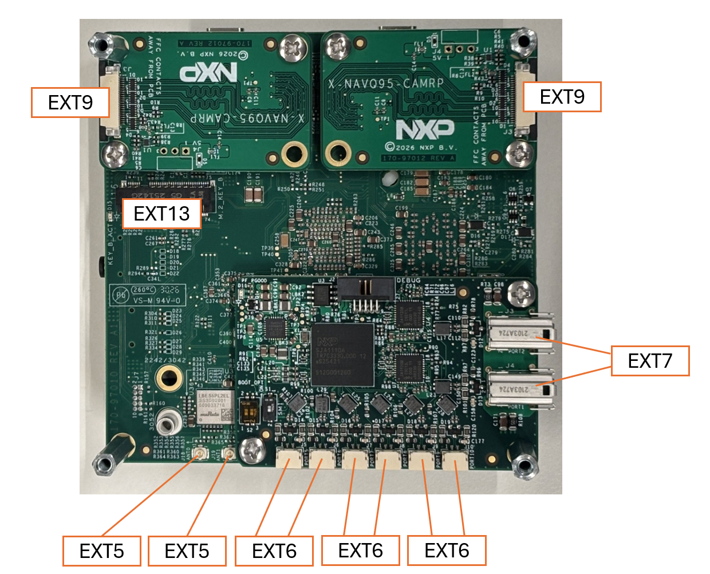

# Parts and connections

| PartNr         | Quantity | Description                          | Connection 1                                   | Connection 2                                     | Connection 3           |
|----------------|----------|--------------------------------------|------------------------------------------------|--------------------------------------------------|------------------------|
| MR-NAVQ95-V2   | 1        | NavQ95B Main board                   |                                                |                                                  |                        |
| MR-NAVQ95E-IO  | 1        | NavQ95B IO shield                    |                                                |                                                  |                        |
| MR-NAVQ95E-T1S | 1        | NavQ95B T1 Switch shield             |                                                |                                                  |                        |
| MR-NAVQ95E-CAM | 2        | NavQ95B Camera shield                |                                                |                                                  |                        |
| EXT_1          | 1        | USB host cable                       | MR-NAVQ95E-IO J1(CONSOLE)                      | Host laptop *                                    |                        |
| EXT_2          | 1        | CAN BUS cable (cable has three ends) | MR-NAVQ95E-IO J5(CAN1)                         | MR-NAVQ95E-IO J4(CAN2)                           | MR-NAVQ95E-IO J3(CAN3) |
| EXT_3          | 1        | Earphones                            | MR-NAVQ95E-IO Earphone jack                    |                                                  |                        |
| EXT_4          | 1        | RJ45 cable                           | MR-NAVQ95-V2 J8(Ethernet port)                 | EXT_15 (Switch/AP) Port 1-4 (yellow socket)      |                        |
| EXT_5          | 2        | 2.4/5GHz antenna                     | MR-NAVQ95-V2 J18 ANT0, J19 ANT1                |                                                  |                        |
| EXT_6          | 3        | 100BASE-T1 cable **                  | MR-NAVQ95E-T1S J5(PORT5), J7(PORT7), J9(PORT9) | MR-NAVQ95E-T1S J6(PORT6), J8(PORT8), J10(PORT10) |                        |
| EXT_7          | 1        | 1000BASE-T1 cable                    | MR-NAVQ95E-T1S J4(PORT1)                       | MR-NAVQ95E-T1S J3(PORT2)                         |                        |
| EXT_8          | 1        | Power supply                         | MR-NAVQ95-V2 J9 (PWR IN)                       | mains                                            |                        |
| EXT_9          | 2        | Camera flatfoil ***                  | MR-NAVQ95E-CAM J3                              | EXT_14 (Raspberry PI Camera)                     |                        |
| EXT_10         | 2        | Kingston USB drive                   | MR-NAVQ95-V2 J13(USB1), J12(USB2)              |                                                  |                        |
| EXT_11         | 1        | RFID antenna                         | MR-NAVQ95-V2 J10(SE_NFC)                       |                                                  |                        |
| EXT_12         | 1        | Kingston M.2 SSD                     | MR-NAVQ95-V2 J1 (M.2 KEY_M)                    |                                                  |                        |
| EXT_13         | 1        | SP M.2 SSD                           | MR-NAVQ95-V2 J16(M.2_KEY_B)                    |                                                  |                        |
| EXT_14         | 2        | Raspberry PI Camera v2.1             |                                                |                                                  |                        |
| EXT_15         | 1        | Switch/AP                            |                                                |                                                  |                        |
| EXT_16         | 1        | Switch/AP power supply               | EXT_15 (Switch/AP) DC-IN                       | mains                                            |                        |
| EXT_17         | 1        | SD-card                              |                                                |                                                  |                        |

\* *Host laptop is not included in the shipment.*

\*\* *There are 3 EXT_6 componentes which are used to connect PORT5-PORT6, PORT7-PORT8 and PORT8-PORT10 of the MR_NAVQ95E-T1S.*

\*\*\* *Make sure the flatfoil is inserted in the same orientation as on the [top](images/emc_test_setup_top.png) and [bottom](images/emc_test_setup_bottom.png) images.*

## Images

